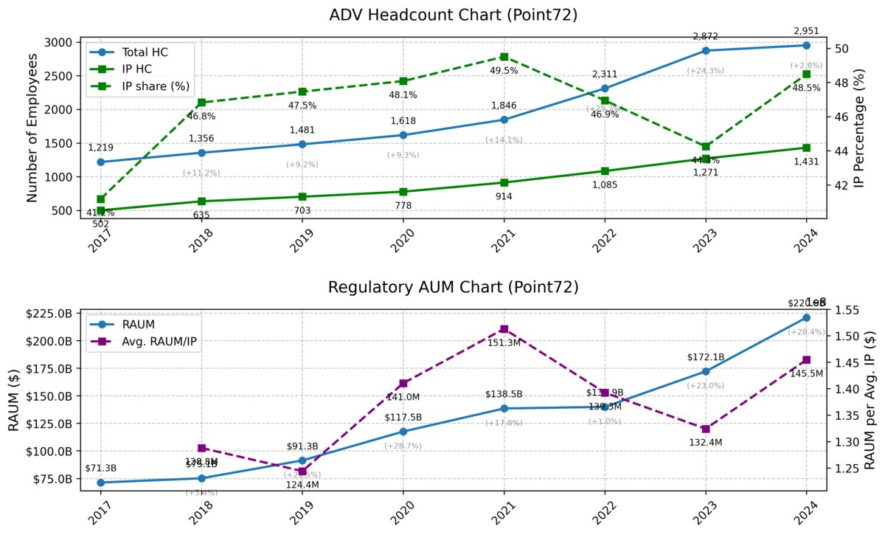
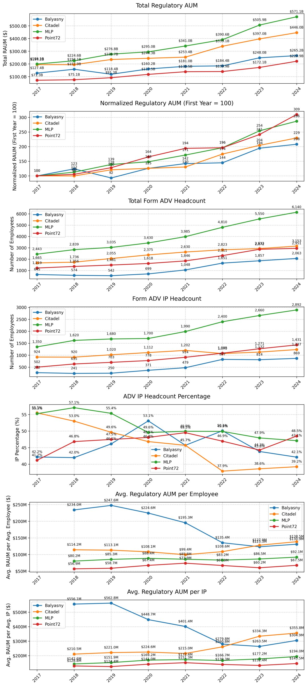

# Form ADV Data Extractor and Plotter

Extract and plot SEC Form ADV Part 1 filing data for investment advisory firms.

## Overview

This tool processes historical SEC Form ADV Part 1 filings to extract key metrics including employee counts, client demographics, regulatory assets under management (RAUM), and custody information. It generates comprehensive visualizations for both single-firm analysis and multi-firm comparisons.

## Data & Charts

### Data Extracted

| Category | Field | Description | Form Field |
|----------|-------|-------------|------------|
| **Filing Information** | Submission Date | Date the filing was submitted | DateSubmitted |
| | Execution Date | Date the filing was executed | Execution Date |
| **Employee Counts** | Total Employees | Total number of employees | 5A |
| | Investment Professionals | Number of investment adviser representatives | 5B1 |
| **Client Counts** | High Net Worth Individuals | Number of high net worth individual clients | 5C1 |
| | Other Individuals | Number of other individual clients | 5C2 |
| | Investment Advisers | Number of other investment adviser clients | 5D1f |
| | Non-US Clients | Number of non-US clients | 5F2d |
| | US Clients | Number of US clients | 5F2f |
| | Private Fund Clients | Number of private fund clients | 9A2b |
| | Pooled Vehicle Clients | Number of other pooled investment vehicle clients | 9B2b |
| **Regulatory AUM** | Total RAUM | Total regulatory assets under management | 5F2a |
| | RAUM by Client Type | Regulatory AUM by client category | 5D3f |
| | US Client RAUM | RAUM from US clients | 5F2c, 5F3 |
| | Non-US Client RAUM | RAUM from non-US clients | 5F2b, 5F2e |
| | Private Fund RAUM | RAUM from private funds | 9A2a |
| | Pooled Vehicle RAUM | RAUM from other pooled investment vehicles | 9B2a |
| **Custody Information** | Private Fund Custody | Assets and clients from private funds | 9A2a, 9A2b |
| | Pooled Vehicle Custody | Assets and clients from pooled vehicles | 9B2a, 9B2b |

> **Note:** The set of extracted fields can be easily expanded by editing the configuration file (`adv_extract_settings.yaml`).

### Charts Produced (non-exhaustive)

- **RAUM Trends**: Total and normalized regulatory assets under management
- **Headcount Metrics**: Total employees and investment professional counts
- **Per-Employee Ratios**: RAUM per employee and per investment professional

### Current Limitations

- The latest filing year is not extracted automatically, as it is only available in PDF format. This data must be entered manually in `adv_extract_firms.yaml`. (A PDF parser is planned for future releases.)

## Example Output

### Single Firm Analysis
When analyzing a single firm, combo charts are generated showing multiple metrics on the same plot:

<a href="docs/adv_plot_single.jpg" target="_blank">

</a>

### Multi-Firm Comparison
When comparing multiple firms, individual charts are generated for each metric:

<a href="docs/adv_plot_multi.jpg" target="_blank">

</a>

## Project Structure

```
form-adv-extract-and-plot/
├── src/                           # Python source code
│   ├── adv_extract.py             # Extract data from ADV files
│   ├── adv_plot.py                # Generate plots from extracted data
│   └── adv_extract_perftest.py    # Performance testing script
├── input/                         # ADV filing data CSV files
├── output/                        # Generated output files
│   ├── csvs/                      # Extracted data files
│   └── plots/                     # Generated plots
├── docs/                          # Documentation and examples
├── adv_extract_settings.yaml      # Main configuration
├── adv_extract_firms.yaml         # Firm definitions and default values
├── requirements.txt               # Python dependencies
└── run.sh                         # Bash script to run the pipeline
```

## Quick Start

### Prerequisites

- Python 3.8+
- pip package manager

### Installation

1. **Clone the repository:**
   ```bash
   git clone <repository-url>
   cd form-adv-extract-and-plot
   ```

2. **Create virtual environment:**
   ```bash
   python -m venv .venv
   source .venv/bin/activate  # On Windows: .venv\Scripts\activate
   ```

3. **Install dependencies:**
   ```bash
   pip install -r requirements.txt
   ```

### Usage

**Prerequisites:**
1. **Download data:** Download historical Form ADV Part 1 filings from the [SEC FOIA Services](https://www.sec.gov/foia-services/frequently-requested-documents/form-adv-data) and extract the CSV files into the `input/` directory

2. **Configure firms:** Edit `adv_extract_firms.yaml` to define the firms you want to analyze

**Option 1: Run the complete pipeline (Recommended)**
```bash
./run.sh
```
This bash script automatically:
- Checks prerequisites and dependencies
- Runs the data extraction
- Generates plots
- Provides status updates throughout the process

**Option 2: Run individual steps manually**

3. **Extract data:**
   ```bash
   python src/adv_extract.py
   ```

4. **Generate plots:**
   ```bash
   python src/adv_plot.py
   ```

5. **Test performance (optional):**
   ```bash
   python src/adv_extract_perftest.py
   ```

## Output Files

- **CSV files**: `output/csvs/adv_data_<firm>_<sec_id>_<crd_id>_<year>.csv`
- **Plots**: `output/plots/adv_plot.png`

## Configuration

### Firm Configuration (`adv_extract_firms.yaml`)

Define firms to analyze with their SEC and CRD identifiers:

```yaml
FIRMS:
  - name: "Example Firm"
    sec_id: "801-12345"
    crd_id: 123456
    default_values:
      2024:
        5A: 1000
        5F2a: 50000000000
        # ... other fields
```

### Settings Configuration (`adv_extract_settings.yaml`)

Configure extraction parameters, target columns, and matching strategies.

## License

MIT License - see [LICENSE](LICENSE) file for details.
